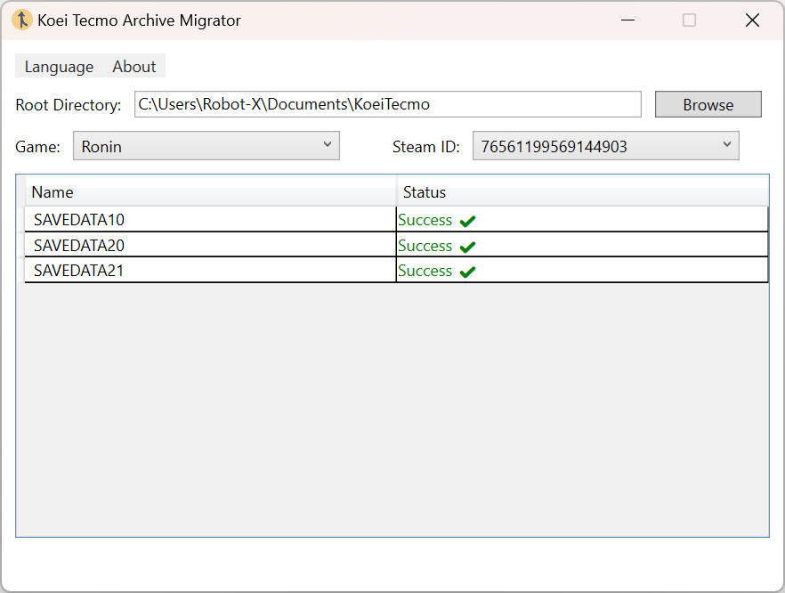
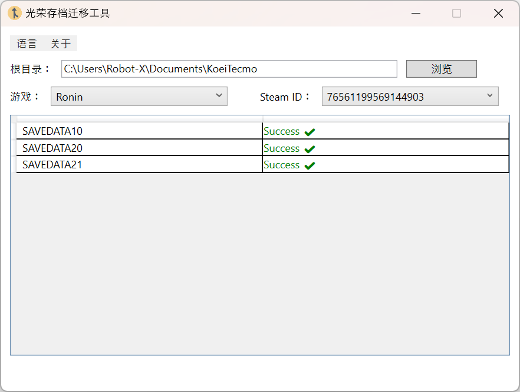

# 🎮 KoeiTecmo 存档迁移工具


一款用于迁移光荣特库摩（Koei Tecmo）游戏存档的 Windows 工具，自动修复存档设备标识符不匹配问题。

## ✨ 功能特性

- 🔍 **智能检测**  
  自动扫描游戏存档目录，识别需要迁移的存档文件
- 🛠 **一键迁移**  
  将存档设备标识符统一为自动存档（SAVEDATAAUTO）的标准
- 🌐 **多语言支持**  
  简体中文/英文界面自由切换
- ⚡ **安全备份**  
  自动创建 `.KoeiTecmoArchiveMigrator` 备份文件
- 📊 **状态可视化**  
  彩色标记不同状态的存档：
  - 🟢 已匹配 | 🟠 需迁移 | 🔴 文件丢失 | ⚪ 未知状态

## 📦 使用指南

### 系统要求

- Windows 10/11 64 位
- [.NET 8.0 Desktop Runtime](https://dotnet.microsoft.com/download)

### 操作步骤

1. **选择根目录**  
   `文档/KoeiTecmo`（默认自动填充）
2. **选择游戏**  
   下拉菜单选择游戏名称（如 `Nioh2`）
3. **选择 SteamID**  
   选择对应的 Steam 用户 ID
4. **勾选存档**  
   工具会自动选中需迁移的存档（`🟠 需迁移`状态）
5. **点击迁移**  
   完成设备标识符统一

## 🖼 界面预览

| 主界面 (英文)                | 主界面 (中文)                   |
| ---------------------------- | ------------------------------- |
|  |  |

**功能说明**：

- 左图：英文界面布局 (`ui.png`)
- 右图：中文界面布局 (`ui-CN.png`)

## ⚙ 技术实现

```csharp
// 核心迁移逻辑
byte[] autoDeviceFlag = ReadDeviceFlag("SAVEDATAAUTO/SAVEDATA.BIN");
using (var fs = new FileStream(targetFile, FileMode.Open, FileAccess.Write))
{
    fs.Seek(0x10, SeekOrigin.Begin); // 设备标识符偏移量
    fs.Write(autoDeviceFlag, 0, 8);  // 写入标准标识符
}
```
