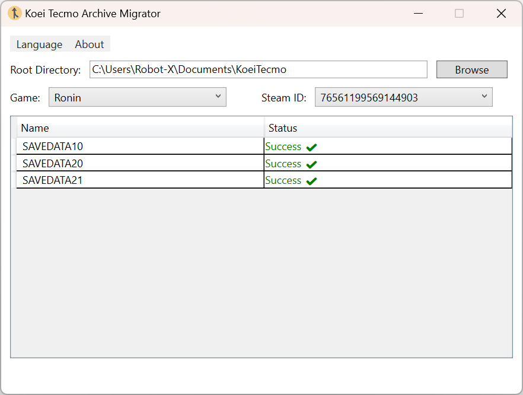
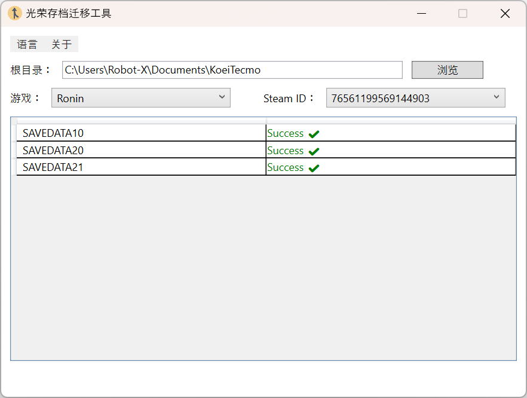

# 🎮 KoeiTecmo Save Data Migrator


A Windows utility for migrating Koei Tecmo game save files, automatically fixing device identifier mismatches.

## ✨ Key Features

- 🔍 **Smart Detection**  
  Automatically scans game save directories and identifies files needing migration
- 🛠 **One-Click Migration**  
  Standardizes device identifiers to match auto-save (SAVEDATAAUTO) format
- 🌐 **Multilingual UI**  
  Supports English/Simplified Chinese interface switching
- ⚡ **Safe Backup**  
  Creates `.KoeiTecmoArchiveMigrator` backup files automatically
- 📊 **Visual Status**  
  Color-coded save file states:
  - 🟢 Matched | 🟠 Needs Migration | 🔴 File Missing | ⚪ Unknown

## 📦 User Guide

### System Requirements

- Windows 10/11 64-bit
- [.NET 8.0 Desktop Runtime](https://dotnet.microsoft.com/download)

### How to Use

1. **Select Root Directory**  
   Default: `Documents/KoeiTecmo`
2. **Choose Game**  
   Select game title (e.g., `Nioh2`) from dropdown
3. **Select SteamID**  
   Choose the corresponding Steam user ID
4. **Check Saves**  
   Tool auto-selects saves needing migration (`🟠 Needs Migration`)
5. **Click Migrate**  
   Standardizes device identifiers

## 🖼 UI Preview

| English UI                  | Chinese UI                     |
| --------------------------- | ------------------------------ |
|  |  |

## ⚙ Technical Implementation

```csharp
// Core migration logic
byte[] autoDeviceFlag = ReadDeviceFlag("SAVEDATAAUTO/SAVEDATA.BIN");
using (var fs = new FileStream(targetFile, FileMode.Open, FileAccess.Write))
{
    fs.Seek(0x10, SeekOrigin.Begin); // Device flag offset
    fs.Write(autoDeviceFlag, 0, 8);  // Write standard identifier
}
```
